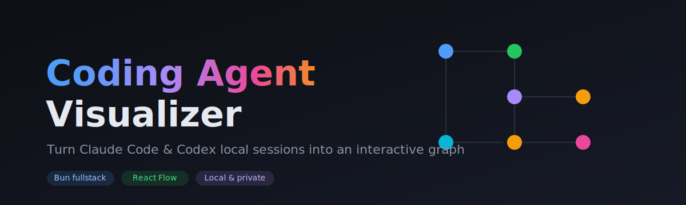
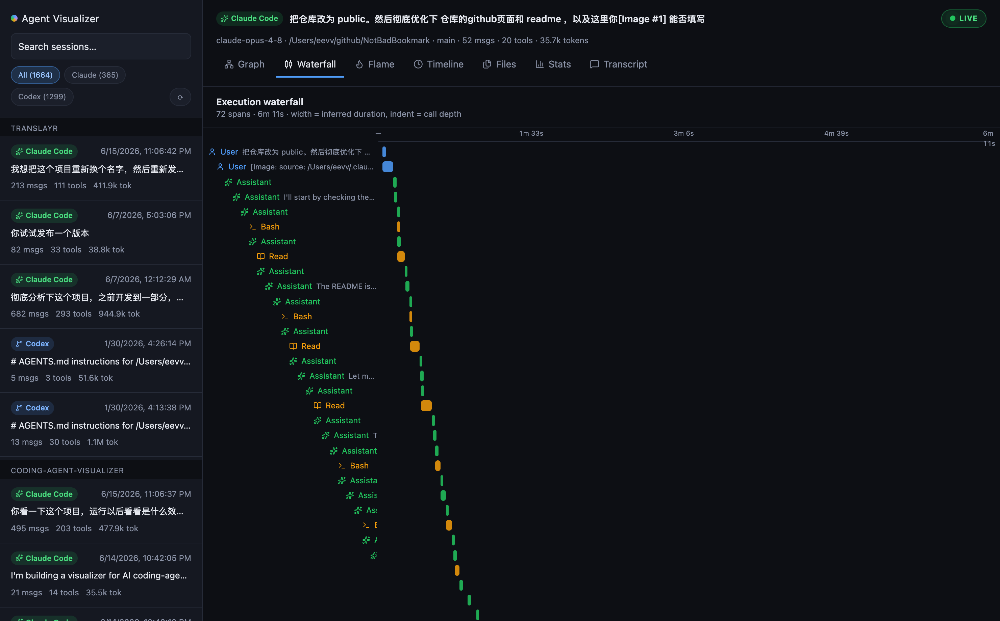
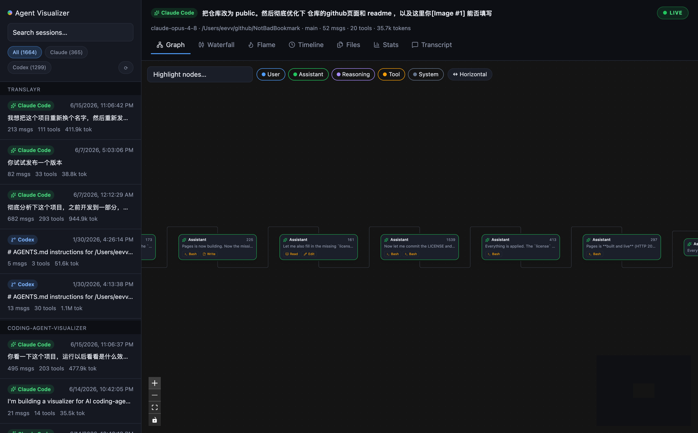
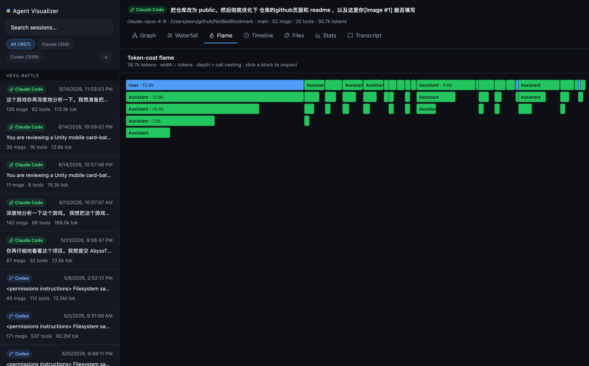
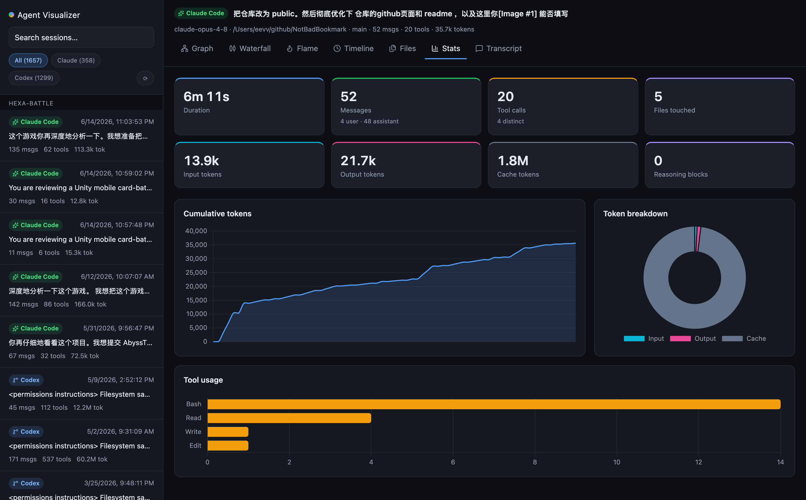

<div align="center">



# Coding Agent Visualizer

**Turn the local session files of your coding agents into a beautiful, interactive map.**

[](https://bun.sh)
[](https://react.dev)
[](https://reactflow.dev)
[](https://tailwindcss.com)
[](https://www.chartjs.org)
[](LICENSE)
[](CONTRIBUTING.md)

[**Live demo / landing page →**](https://everettjf.github.io/coding-agent-visualizer/)

</div>

---

Coding agents like **Claude Code** and **OpenAI Codex** quietly record every
session to disk as JSONL — messages, reasoning, tool calls, file edits and token
usage. That data is a goldmine, but it lives in raw log files no one reads.

**Coding Agent Visualizer** reads those local files and renders them as an
interactive **execution graph**, a distributed-tracing **span waterfall**, a
token-cost **flame graph**, a **file heatmap** and an **analytics dashboard** —
so you can actually *see* what your agent did, how it branched into sub-agents,
which files it hammered, and where the tokens went.

No office mascots, no 3D robots. Just a fast, good-looking, *useful* lens on
real agent runs. Everything runs locally — your transcripts never leave your
machine.

<div align="center">

### Span waterfall — every event as a span, indented by call depth



| Execution graph | Token-cost flame | Analytics |
|:---:|:---:|:---:|
|  |  |  |

</div>

## ✨ Features

| | |
|---|---|
| 🕸️ **Execution graph** | Conversation rebuilt as a graph and laid out left-to-right with [dagre](https://github.com/dagrejs/dagre). Tool-only turns fold into chips, fragments reconnect into one spine, sub-agents branch off — a readable flow instead of an endless staircase. |
| 🌊 **Span waterfall** | The distributed-tracing view (à la Jaeger / LangSmith / Phoenix): every event is a span, indented by call depth, positioned on a shared time axis, width = inferred duration. |
| 🔥 **Token-cost flame** | An icicle (top-down flame graph) where width ∝ tokens and depth = call nesting — a token-heavy turn or sub-agent jumps right out. Built on `d3-hierarchy`. |
| ⏱️ **Timeline** | Every event placed on a time track with role colors and previews — see the rhythm and gaps of a session. |
| 🗂️ **File heatmap** | Which files the session touched and how often, colored cool→hot by edit frequency. |
| 📊 **Stats dashboard** | Duration, message/tool counts, input/output/cache tokens, a cumulative-token line, a token-breakdown doughnut and per-tool bars — all rendered with **Chart.js**. |
| 💵 **Real dollar cost** | Token counts turned into **USD** under each model's published pricing (cache reads/writes priced separately) — per session on Stats, and aggregated total / per-model in analytics. |
| 💬 **Transcript** | A clean, readable conversation view with collapsible tool blocks. |
| 🔎 **Full-text search** | Search across **every** session body — messages, reasoning and tool I/O — with snippets, not just titles. |
| ⚖️ **Compare sessions** | Diff two runs metric-by-metric — duration, tokens, cost and tool usage with signed deltas — to see what changed when you tweaked a prompt. |
| 📂 **Open any file** | Drag-and-drop (or pick) a transcript from anywhere; the source is auto-detected and rendered through every view. |
| 🔍 **Graph search & filters** | Highlight matching nodes; toggle roles (hide reasoning/tools), flip layout horizontal/vertical. |
| 🧩 **Diff & inspect** | Click any node for full message / reasoning / tool I/O, with syntax-highlighted diffs for `Edit`/`Write` and one-click copy. |
| 🗂️ **Multi-source** | **Claude Code**, **Codex**, **Gemini CLI**, **Qwen Code**, **OpenCode**, **Cursor** and **Cline** today; a new agent is just one pluggable adapter away. |
| 📝 **Annotations** | Flag any turn and jot a private note (stored locally); export flagged turns as a Markdown review document. |
| 🌐 **Online demo** | A fully client-side [demo](https://everettjf.github.io/coding-agent-visualizer/demo/demo.html) — drop a transcript and explore it in the browser, nothing uploaded. |
| 🔴 **Live tail** | Toggle **LIVE** to stream a session into the graph as the agent writes to disk — watch it think in real time. |
| 📈 **Cross-session analytics** | Aggregate every local session: token & cost over time, tool-usage trends, and per-source / per-model / per-project breakdowns. |
| 🧬 **Collapsible sub-agents** | Fold a whole sub-agent (sidechain) branch into its entry node — collapse one or all at once to focus the graph. |
| 📤 **Export** | Save any session as **Markdown** or a self-contained, shareable **HTML** transcript — generated locally, nothing uploaded. |

## 🚀 Quick start

Requires [Bun](https://bun.com/) (≥ 1.2). Install it if you haven't:

```bash
# macOS & Linux
curl -fsSL https://bun.sh/install | bash

# Windows (PowerShell)
powershell -c "irm bun.sh/install.ps1 | iex"
```

**Run it without cloning:**

```bash
bunx coding-agent-visualizer@latest   # → http://localhost:19876
```

Set a different port with `PORT=4000 bunx coding-agent-visualizer@latest`. After a
global install (`bun add -g coding-agent-visualizer@latest`) you can launch it with
the short `cav` command.

**Or grab a standalone binary (no Bun needed):**

Download the executable for your platform from the
[latest release](https://github.com/everettjf/coding-agent-visualizer/releases/latest)
and run it — the whole app and the Bun runtime are bundled into one file:

```bash
./coding-agent-visualizer-darwin-arm64   # → http://localhost:19876
```

**Or clone for development:**

```bash
git clone https://github.com/everettjf/coding-agent-visualizer.git
cd coding-agent-visualizer
bun install
bun dev          # → http://localhost:19876
```

The app auto-discovers sessions from:

- **Claude Code** — `~/.claude/projects/<encoded-cwd>/*.jsonl`
- **Codex** — `~/.codex/sessions/YYYY/MM/DD/rollout-*.jsonl`
- **Gemini CLI** — `~/.gemini/tmp/<project-hash>/checkpoint-*.json`
- **Qwen Code** — `~/.qwen/tmp/<project-hash>/checkpoint-*.json` (Gemini-compatible fork)
- **OpenCode** — `~/.local/share/opencode/storage/{session,message,part}/…`
- **Cursor** — the IDE's `state.vscdb` SQLite (composer chats)
- **Cline** — VS Code globalStorage `…/saoudrizwan.claude-dev/tasks/<id>/`

Pick a session from the sidebar and explore — or **drop any transcript file**
onto the window to visualize one from outside those locations. Nothing is
uploaded anywhere.

## 🧱 Architecture

A single **Bun fullstack server** (`Bun.serve`) serves both the React UI and a
tiny local-data API — no separate backend, no database, no telemetry.

```
src/
├─ lib/
│  ├─ types.ts            # UnifiedSession / SessionNode — the shared model
│  ├─ stats.ts            # computeStats() + buildTrace()/buildHierarchy() derivations
│  ├─ pricing.ts          # model → published USD rates; token breakdown → cost
│  ├─ analytics.ts        # cross-session aggregation (cost/time, tool & model trends)
│  ├─ discovery.ts        # scan all sources (mtime-cached), search, upload, dispatch
│  └─ adapters/
│     ├─ claudeCode.ts    # uuid/parentUuid tree → nodes; tool calls; tokens
│     ├─ codex.ts         # rollout response_items → nodes
│     ├─ gemini.ts        # Gemini Content[] (checkpoints) → nodes; also Qwen Code (fork)
│     ├─ opencode.ts      # session/message/part JSON files → nodes
│     ├─ cursor.ts        # state.vscdb SQLite composer chats → nodes
│     └─ cline.ts         # Cline task JSON (Anthropic messages + UI events) → nodes
│  ├─ pricing.ts          # model → published USD rates; token breakdown → cost
│  ├─ search.ts           # inverted index (prefix + TF ranking) for full-text search
│  └─ parseUpload.ts      # browser-safe "detect + parse a dropped transcript"
├─ cli.ts                 # `bunx coding-agent-visualizer` launcher
├─ server/index.ts        # Bun.serve: UI + /api/sessions, /api/session, /api/analytics, /api/search, /api/parse
└─ frontend/
   ├─ App.tsx             # sidebar, search, Radix tabs, export menu, panel orchestration
   ├─ demo.tsx            # standalone client-side online demo (GitHub Pages)
   ├─ GraphView.tsx       # React Flow + dagre graph, collapsible sub-agents
   ├─ DetailPanel.tsx     # node inspector (message / reasoning / tool / diff / notes)
   ├─ ui.tsx              # role/tool/source colors + lucide icon mapping
   ├─ lib/
   │  ├─ charts.ts        # Chart.js registration + dark-theme defaults
   │  ├─ highlight.tsx    # tiny dependency-free syntax highlighter for diffs
   │  ├─ annotations.ts   # local per-node flags + notes (localStorage) + export
   │  ├─ export.ts        # session → Markdown / self-contained HTML
   │  └─ utils.ts         # cn() Tailwind class merge helper
   └─ views/              # Waterfall / Flame / Timeline / Files / Stats / Transcript / Analytics / Compare
```

The UI is **Tailwind v4** (via `bun-plugin-tailwind`, wired in `bunfig.toml`) with
**Radix** primitives and **lucide** icons; charts are **Chart.js**, the graph
layout is **dagre**, and the flame hierarchy uses **d3-hierarchy**.

### The unified model

Every adapter normalizes its raw format into one shape, so all views are
source-agnostic and a new agent only needs a new adapter:

```ts
UnifiedSession {
  id, source, cwd, gitBranch, startedAt, endedAt,
  messageCount, toolCallCount, totalTokens, model,
  nodes: SessionNode[]          // DAG via parentId; tool calls are children
}

SessionNode {
  id, parentId, role: user | assistant | tool | reasoning | system,
  timestamp, isSidechain,       // isSidechain = Claude Code sub-agent branch
  text?, thinking?,
  tool?:   { name, input, result, isError, files[] },
  tokens?: { input, output, cacheRead, cacheCreation }
}
```

## 🔌 Adding a new source

1. Create `src/lib/adapters/<name>.ts` exporting a parser that returns a
   `UnifiedSession` (see `claudeCode.ts` as the reference).
2. Register its directory + dispatch in `src/lib/discovery.ts`.
3. That's it — every view works automatically.

## 🛠️ Scripts

| Command | Description |
|---|---|
| `bun dev` | Dev server with hot reload |
| `bun start` | Production server |
| `bun run build` | Bundle the frontend to `dist/` (also a CI build check) |
| `bun run compile` | Build a standalone single-file executable (no Bun needed to run) |
| `bun test` | Adapter + library unit tests (runs against `fixtures/`) |
| `bun run typecheck` | TypeScript check (`tsc --noEmit`) |
| `bun scripts/shot.ts` | Headless smoke test — opens every tab, reports runtime errors |
| `bun scripts/capture.ts` | Regenerate the README / landing-page screenshots |

All six adapters are covered by tests validated against realistic sample logs in
`fixtures/`: Claude Code / Codex / Gemini / Cline in `adapters.test.ts`, and the
non-JSONL OpenCode (fixture storage tree) and Cursor (in-memory SQLite) adapters
in `extra.test.ts`. Pricing/cost (`pricing.test.ts`), cross-session aggregation,
full-text search + upload detection (`discovery.test.ts`), the diff syntax
highlighter and the Markdown/HTML exporters are unit-tested too. The Claude Code
adapter is additionally verified against real local sessions (graph integrity:
single connected tree, tool results linked, files tracked).

## 🔒 Privacy

Everything is read from your local disk and rendered in your local browser.
There is no backend service, no account, and no network egress.

## 📄 License

[MIT](LICENSE) © everettjf
